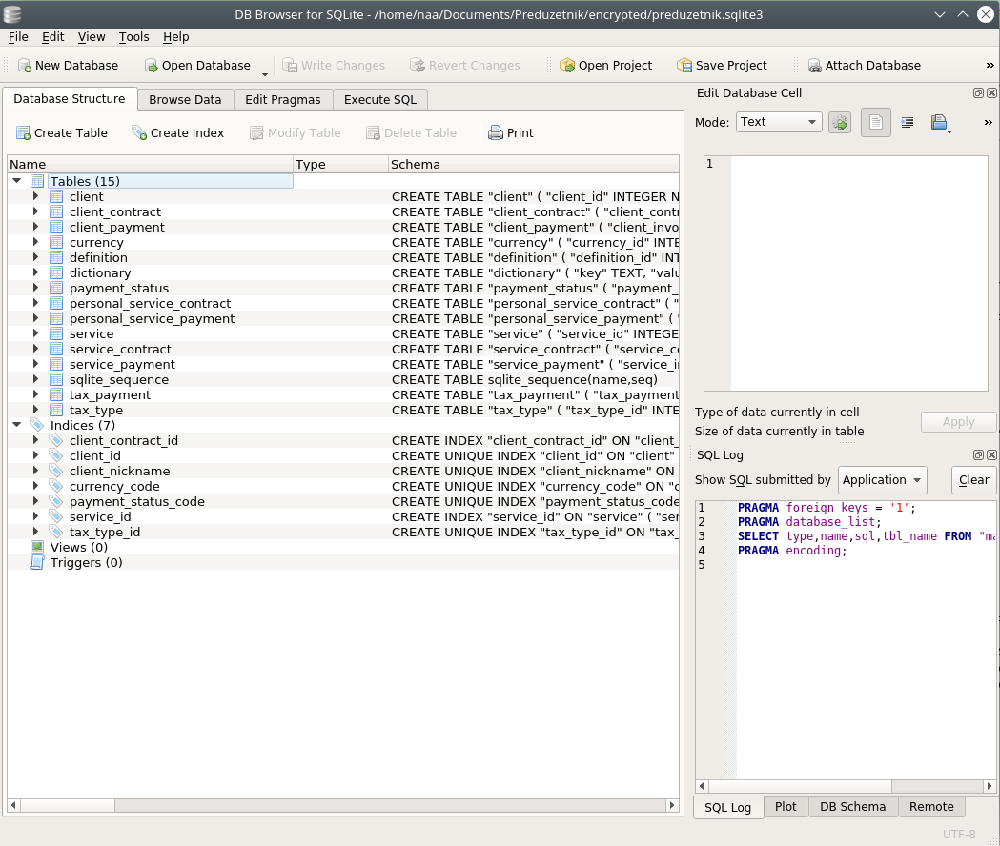
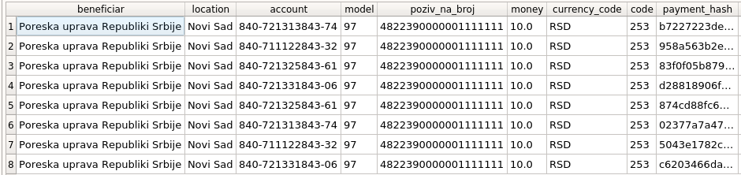

# Documentation as a code


## Технологии

- [git](https://git-scm.com/downloads) (Github/Gitlab) (Для version controlling)
- [git-crypt](https://dev.to/heroku/how-to-manage-your-secrets-with-git-crypt-56ih) (По умолчанию git не шифрует данные, с данной технологией он хранит в зашифрованном виде на удаленном сервере)
- [sqlitebrowser](https://sqlitebrowser.org/) (база данных для ведения учета документации и бухгалтерии) (P.S. на самом деле это графический инструмент работы с sqlite3 :) )
- python3.10 для скриптов (технически можно скомпилировать в бинарники, но на практике так много ОСей и архитектур)

## Вступление

Вступив на путь иммигранта, я встретил необходимость организации быстро растущей организации. В особенности это стало понятно после открытия Предузетника(ИП) в Сербии, и самостоятельного учета прихода, расхода на различные налоги и товары для ИП. А так же хотелось организацию быстро растущего количества документации.

- Существующие решения вида 1С. Но это проприетарное решение, и вообще не торт связываться с этим рядовому программисту
- Существует open source решение [GnuCash](https://www.gnucash.org/) для схожих целей для малого бизнеса, но мне не понравилось полное отсутствие кастомизации
- Я был вдохновлен идеей, того что в НГТУ использовали в прямом виде SQL базу данных для учета документации для всего университета
- Я хотел резервного копирования своей документации через Git, а так же version controlling через него же с легким восстановлением любой части документации

## К чему я пришел

- во первых использовать Git для будущего хранения документации.... но у Git есть минус в отсутствии шифрования. А документацию то предстоит хранить секретную!
- Я хотел шифрование файлов отдельное для каждого файла, и чтобы при повторном шифровании не надо было сохранять данные файлы заново! Мне повезло и я нашел решение абсолютно подходящее моему случаю: git-crypt
    - git-crypt делает так чтобы локально файлы были не шифрованы, а при отправке в Remote repository (Github/Gitlab and etc) файлы отправляются уже зашифрованными. Для нас все прозрачно и просто, мы даже не замечаем локально шифрования, мы только проверяем иногда через git-crypt status то что все файлы зашифрованы. Использование абсолютное простое и не дает никакой дополнительной на нас нагрузки! Мы пользуется Git точно так же как и прежде, просто дополнительно настроили автоматическое шифрование при инициализации репозитория.
- Для учета ведения документации, прихода и расходов я пришел к инструменту [Sqlitebrowser](https://sqlitebrowser.org/). Инструмент для полного обращения с SQLite через GUI! И при этом он явно имеет все особенности необходимые как раз для офисного использования (а именно импорт/экспорт данных в разных форматах). Sqlite хранит свою бд локальным файлом а значит все её содержимое будет зашифрованно git-crypt вместе с остальными документами.
- Создание SQL таблиц под ведения учета любых сервисов, налогов, инвойсов и их оплат. Все вносится классическим SQL(lite), за исключением того как я поступил с документами. Обычно люди хранят ссылку на документ в БД, а сам документ хранят в файловой системе. Я Почитал что это не удобно с точки зрения рефакторизации документации, и сделал подход через хэш значения, для того чтобы документы можно было легко переименовывать и дополнительно групировать в субпапки по дополнительным категориям (по месяцам/годам к примеру) и перетаскивать без необходимости менять значения в базе данных
  - Скрипт [./generate_hash.py](secret_repository/generate_hash.py) (см. [secret_repository](secret_repository)) генерирует нам случайное значение вида `833f26c9e0c47edd`. Данное значение мы вносим в конец имени файла инвойса в стиле `september_invoice_hash_833f26c9e0c47edd.pdf`. В базу данных в нужную запись мы вносим лишь данное хеш значение `833f26c9e0c47edd`.
  - Скрипт [./validate_hashes.py](secret_repository/generate_hash.py) запускает тесты нашего репозитория.
      - Он считывает все имена файлов в репозитории, и все значения документовых хешей из Sqlite db (библиотека для работы с Sqlite встроена в CPython по умолчанию),
      - после чего проверяет что для каждого хеш значения в БД присутствует один и только один с таким хеш значением документ в файловому системе.
      - При нарушении правил выше, выполнение тестов завершается не с нулевым return_code, данные записи выводяться в консоль и счетчик failed_tests увеличеваеться.
      - Так же он через regex считывает все хеш значения упомянутые в файлах репозитория, и проверяет что они хотябы один раз упомянуты где либо в значения базы данных, если этого не происходит, то увеличеваеться счетчик warning_zombie_hashes
      - Если в одной из ячеек БД где должен быть документ стоит значение NULL, то увеличеваеться счетчик тестов пройденных с Warning
      - Если находиться файл в репозитории содержащий в имени TODO, он будет упомянут в Warnings
Пример работы скрипта
```
# Множество записей о пройденных тестах
...
TestResult(params=ValidatableTarget(column_name='document_hash', table_name='tax_type'), hash='1cfe8314575617fa', state=<TestState.passed: 2>, warnings=[])
TestResult(params=ValidatableTarget(column_name='document_hash', table_name='tax_type'), hash='b1a38708fd50132c', state=<TestState.passed: 2>, warnings=[])
TestResult(params=ValidatableTarget(column_name='document_hash', table_name='tax_type'), hash='b1a38708fd50132c', state=<TestState.passed: 2>, warnings=[])
TestResult(params=ValidatableTarget(column_name='document_hash', table_name='tax_type'), hash='b1a38708fd50132c', state=<TestState.passed: 2>, warnings=[])
============================================WARNING_TODOS============================================
WARNING TODO: TODO_scan_and_add_all_bills is discovered at path TODO_scan_and_add_all_bills!
WARNING TODO: TODO_receive_OMS is discovered at path Personal/Services/SerbGovernment/OMS/TODO_receive_OMS!
WARNING TODO: TODO_filled_application_UPD_visit_MUP_for_date_of_registration is discovered at path Personal/Services/SerbGovernment/RadnaDozvola/TODO_filled_application_UPD_visit_MUP_for_date_of_registration!
WARNING TODO: TODO_sudeb_perevodi_UPD_get_on_friday is discovered at path Personal/Services/SerbGovernment/RadnaDozvola/TODO_sudeb_perevodi_UPD_get_on_friday!
passed_tests amount: 99
warning_passed_tests amount: 0
warning todos discovered: 4
WARNING_ZOMBIE_HASHES discovered: 0
failed_tests amount: 0
```

## Подробности

### Git

- Для тех кто может использует [GIT CLI](https://git-scm.com/downloads), для тех кто нет, можно использовать какие нибудь графические интерфейсы по вкусу (SourceTree классный для винды и мака)
- Скрипт [./git_remote_set.py](secret_repository/git_remote_set.py) содержит пример, как настроить гит репозиторий чтобы он одновременно пушил в два облачных репозитория (я сохраняю в Github и Gitlab одновременно для надежности)

### Git-crypt
Как настроить [git-crypt](https://github.com/AGWA/git-crypt) можно найти в этих двух замечательных туториалах:

- [Простой туториал, достаточно его](https://dev.to/heroku/how-to-manage-your-secrets-with-git-crypt-56ih)
- [Опциональная продвинутая версия настройки с GPG ключами](https://buddy.works/guides/git-crypt)

P.S. Процесс установки прост для линукса и макоси так как можно установить git-crypt из package managers (например apt или brew), а вот для виндовса придеться научиться компилировать исходный код самостоятельно

### Sqlitebrowser



- Предоставляю пример моих таблиц c dummy данными для [Sqlitebrowser](https://sqlitebrowser.org/) в файле [preduzetnik.sqlite3](secret_repository/encrypted/preduzetnik.sqlite3) (открывать через Sqlitebrowser)
- Структура таблиц легко меняется через GUI без SQL кода! Вместе с миграцией данных!

#### Мои Entity Relationship Diagrams

#### Налоги

- Учет налогов у меня специально кастомизирован под сербские правила, у меня все те  нужные поля которые мне действительно нужны
- Таблица с `tax_type` формируется на основе решений полученных из налоговой, отсканированные решения прилагаются хеш значением к строке данной таблицы
- Когда нам поступают инвойсы оплатить налоги, мы вносим их в таблицу `tax_payment`, и инвойс документ в `invoice_hash`
- После оплаты мы дополняем строку документом оплаты из банка в `payment_hash` столбец
- `payment_status_code` имеет значения (`not_paid`, `sent`, `paid`), соответственно (не оплачено, платеж отправлен но у нас нет подтверждения что получен, и платеж прошел и подтвержден в налоговой).
- `currency_code` имеет значения по общемировому стандарту, например `RSD` (сербские динары), `EUR` (для евро), для того чтобы мы могли написать SQL запросы приводящие доходы и расходы к единой валюте результата

<!DOCTYPE html>

<html lang="en">
<head>
  <meta charset="utf-8">
</head>
<body>
  <div class="mermaid">
  erDiagram
      tax_type {
        integer tax_type_id PK
        text description
        text account
        integer model
        text poziv_na_broj
        integer code
        integer year
        text document_hash
      }
      tax_type ||--o{ tax_payment : contains
      tax_payment {
        integer tax_payment_id PK
        integer tax_type_id FK
        text payment_status_code FK
        real money
        text currency_code FK
        text invoice_hash
        text date_invoiced
        text payment_hash
        text date_paid
      }
      tax_type |o--|| payment_status : contains
      payment_status {
        integer payment_status_id
        text payment_status_code
        text description
      }
      tax_type |o--|| currency : contains
      currency {
        integer currency_id PK
        text currency_code
        text name
        real to_eur
        real to_rsd
      }


  </div>
 <script src="mermaid.min.js"></script>
 <script>mermaid.initialize({startOnLoad:true});
</script>
</body>
</html>

Особое удобство заключаеться в том что мы можем выполнить SQL запрос вида

```sql
SELECT
(SELECT value FROM definition WHERE definition_key = "beneficiar_serb_tax_gov") as beneficiar,
(SELECT value FROM definition WHERE definition_key = "location_town") as location,
tax_type.account, 
tax_type.model, 
tax_type.poziv_na_broj, 
tax_payment.money, 
tax_payment.currency_code, 
tax_type.code, 

tax_payment.payment_hash, tax_payment.date_paid, tax_payment.payment_status_code,
tax_type.description
FROM tax_payment
INNER JOIN tax_type ON tax_payment.tax_type_id = tax_type.tax_type_id
```

В следствии чего мы получим таблицу с выводом данных именно в топ порядке столбцов каком надо для оплаты налогов к примеру в Райфайзен банке


Мы можем брать значения буквально по очереди из каждого столбца для заполнения нужной формы!

#### Клиенты

Помимо этого мы ведем учет доходов от клиентов, и всей документации связанной с этим

<!DOCTYPE html>

<html lang="en">
<head>
  <meta charset="utf-8">
</head>
<body>
  <div class="mermaid">
  erDiagram
      client {
        integer client_id PK
        text nickname
        text name
      }
      client ||--o{ client_contract : contains
      client_contract {
        integer client_contract_id PK
        integer client_id FK
        text document_hash
        text description
      }
      client ||--o{ client_payment : contains
      client_payment {
        integer client_invoice_id PK
        integer client_id FK
        real money
        currency_code text FK
        text payment_status_code FK
        text invoice_hash
        text date_invoiced
        text acceptance_hash
        text date_accepted
        text payment_hash
        text date_paid
        text note
      }
      client_payment |o--|| payment_status : contains
      payment_status {
        integer payment_status_id
        text payment_status_code
        text description
      }
      client_payment |o--|| currency : contains
      currency {
        integer currency_id PK
        text currency_code
        text name
        real to_eur
        real to_rsd
      }


  </div>
 <script src="mermaid.min.js"></script>
 <script>mermaid.initialize({startOnLoad:true});
</script>
</body>
</html>

- Любые контракты в таблицу контрактов, со внесением хеша документов
- Любые платежи следует логике что мы сначала имеем инвойс документ клиенту, после чего происходит платеж. Оба документа вносяться в соответствующую строку таблицы (`invoice_hash` и `payment_hash`).
- `payment_status_code` и `currency_code` аналогичны секции о налогах выше и являются теми же самыми таблицами.

#### Сервисы

Под сервисами понимаются все кому мы чтото платим и пользуемся их услугами. В данном случае это банки, магазины электроники, облачные провайдеры, сербское правительство, налоговая, APR.

- в таблицу `service` для упрощения вношу все возможные сущности
- в таблицу `service_contract` я вношу договоры отношения с этими сущности которые относятся к предузетнику
- в таблицу `service_payment` я вношу платежи от имени компании, эти платежи идут с налоговым вычетом :)

<!DOCTYPE html>

<html lang="en">
<head>
  <meta charset="utf-8">
</head>
<body>
  <div class="mermaid">
  erDiagram
      service {
        integer service_id PK
        text nickname
        text name
      }
      service ||--o{ service_contract : contains
      service_contract {
        integer service_contract_id PK
        integer service_id FK
        text document_hash
        text description
        text date_created
      }
      service ||--o{ service_payment : contains
      service_payment {
        integer service_invoice_id PK
        integer service_id FK
        real money
        currency_code text FK
        text payment_status_code FK
        text invoice_hash
        text date_invoiced
        text payment_hash
        text date_paid
        text note
      }
      service_payment |o--|| payment_status : contains
      payment_status {
        integer payment_status_id
        text payment_status_code
        text description
      }
      service_payment |o--|| currency : contains
      currency {
        integer currency_id PK
        text currency_code
        text name
        real to_eur
        real to_rsd
      }


  </div>
 <script src="mermaid.min.js"></script>
 <script>mermaid.initialize({startOnLoad:true});
</script>
</body>
</html>

#### Personal

Часть документов и платежей остаются личными, относящимися к физическому лицу. Но по какой то причине тоже относяться к нашему предузетнику (Например `белый картон` нужен для открытия предузетника, или `паспорт` и т.д.). Так как учет личных документов и платежей тоже хотелось бы как то вести, поэтому мы заводим отдельные таблицы чтобы избежать смешивания с данными компании. (Напомним, все это для ИП 1 человека-программиста ведущего свою документацию и бухгалтерию)

<!DOCTYPE html>

<html lang="en">
<head>
  <meta charset="utf-8">
</head>
<body>
  <div class="mermaid">
  erDiagram
      service {
        integer service_id PK
        text nickname
        text name
      }
      service ||--o{ personal_service_contract : contains
      personal_service_contract {
        integer personal_service_contract_id PK
        integer service_id FK
        text document_hash
        text description
        text date_created
      }
      service ||--o{ personal_service_payment : contains
      personal_service_payment {
        integer personal_service_invoice_id PK
        integer service_id FK
        real money
        currency_code text FK
        text payment_status_code FK
        text invoice_hash
        text date_invoiced
        text payment_hash
        text date_paid
        text note
      }
      personal_service_payment |o--|| payment_status : contains
      payment_status {
        integer payment_status_id
        text payment_status_code
        text description
      }
      personal_service_payment |o--|| currency : contains
      currency {
        integer currency_id PK
        text currency_code
        text name
        real to_eur
        real to_rsd
      }

  </div>
 <script src="mermaid.min.js"></script>
 <script>mermaid.initialize({startOnLoad:true});
</script>
</body>
</html>

- Таблицы практически полностью повторяют тоже что и для компании. Даже `service` таблица переиспользуется та же самая.

## Итого

После того как я рефакторизовал всю свою документацию по данной схеме я получил:

- Документация очень сильно кастомизирована именно под наш случай. Ничего лишнего, все нужное.
- В удалил все дубликаты документов ненужные или худшего качества
- Я легко стал находить нужные документы. По большей части папки репозитория организованы по принципу повторяющему базу данных, но дополнительно группируют данные по месяцам/годам
- Удобно собирать документы для каких нибудь событий. Достаточно завести файл TODO_event_name, и наш `./validate_hashes.py` поймает warning сообщающий об этом.
- Вся документация автоматом идет резервной копией между нашим локальным ПК и двумя облачными ресурсами (Github/Gitlab).
- Происходит version control документации, легко откатиться к предыдущему состоянию для любых ее частей
- Доступен универсальный язык для запроса прибыли итого или с групировкой по месяцам/годам, а так же расходов на налоги или сервисы. SQL язык богат и удобен.
- Ведение базы данных очень гибко удобное, через графический интерфейс быстро можем отредактировать структуры и мигрировать все данные без всякого кода
- Документация защищена шифрованием через git-crypt
- Все это базовые инструменты которые все равно любой программист осваивает, мы пользуемся любимыми знакомыи инструментами, мы получаем халявную практику в чистом SQL вдобавок.

P.S. Все скрипты текущего репозитория вы можете найти [здесь](https://github.com/darklab8/darklab_article_documentation_as_a_code/tree/master/src/secret_repository) вместе с примерой структуры репозитория (кроме SQL запроса)

## Рекомендации

### к изучению SQL:

- Если начинать SQL с самого нуля, если замечательная манга для самых чайников в понятном виде


- Помимо этого рекомендую интерактивный туториал для освоения SQL - [SQLBolt](https://sqlbolt.com/)

- Так же с учетом того что мы работаем с SQLite, было бы неплохо почитать [её официальную документацию](https://www.sqlite.org/docs.html)

### к изучению Git

- Можно найти самые простые вводные курсы во внутренних курсах вашей компании если она относиться к IT
- [Атлассиновский туториал довольно таки неплох для освоения начал](https://www.atlassian.com/ru/git/tutorials/what-is-version-control)
- [Проникнуться желательно 6 лучшими практики этого инструмента](https://deepsource.io/blog/git-best-practices/)
- [Интерактивный курс обучения Git](https://learngitbranching.js.org/)
- [Open Source book for Open Source tool, для освоения от начал до продвинутого уровня: Git Pro :)](https://git-scm.com/book/en/v2)

### Помимо основных технологий я еще использую вторичные для линукса

для распознавания PDF документов в тексто выделяемые PDF:

- `apt install -y ocrmypdf`
  - `ocrmypdf source_name source target`

для изменения разрешения jpeg файлов в меньший размер

- `sudo apt install -y imagemagick`
  - `convert image_source -resize 10% image_output`

для соединения, расклеивания, вращений PDF документов

- `sudo apt install -y pdftk-java` 
  - `install PDF Chain as GUI from ubuntu discovery of apps`

Для написания PDF документах в качестве кода, latex(xelatex-lualtex) стабильный инструмент

- `sudo apt-get install texlive-xetex`
    - [documentation](https://www.overleaf.com/learn/latex/XeLaTeX)
    - compile with `xelatex 1.tex`
- для написания с hot reloading:
    - `sudo apt-get install -y latexmk`
    - vscode plugin `Latex Workshop`
        - View Latex PDF File

Для прикрепления подписи в PDF документы

- xournal
    - https://askubuntu.com/questions/167274/how-can-i-edit-a-picture-into-an-existing-pdf-file
    - `sudo apt-get install xournal`
    - click File>Annotate PDF, choose your PDF file.
        - Now, go to where you need to add your signature and click Tools>Image (or the "Image" toolbar icon), then click where you want to add the image. An image selection dialog appears, select your image.


    


### Пригодяться физические сканеры

- я выбрал EPSON DS-310 для многостраничного скана и EPSON Perfection V19 для планшетного скана.
- Оба сканера дружелюбны для линукса (на ubuntu точно драйвера есть), и для макоси и для винды. Заодно и дешевые.
- Хотя будем честны многостраничный сканер при большом количестве документов все таки застревают иногда. Зато сканит за 1 секунду приняв и выкинув.

### Организация документов в физическом мире

- Внесенные в базу данных документы, можно раскладывать по папкам с жёсткой обложкой, именнованные по какой либо категории схожей с нашей базой данных. Все документы тогда будут достаточно быстро находиться, и вы будете уверены что они были оцифрованы.

## Контакты и примечания:

- [email: dark.dreamflyer@gmail.com](mailto:dark.dreamflyer@gmail.com)
- [github](https://github.com/darklab8/darklab_article_documentation_as_a_code)
- [license: MIT](https://github.com/darklab8/darklab_article_documentation_as_a_code/blob/master/LICENSE)